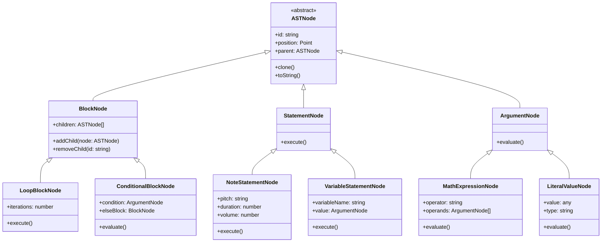
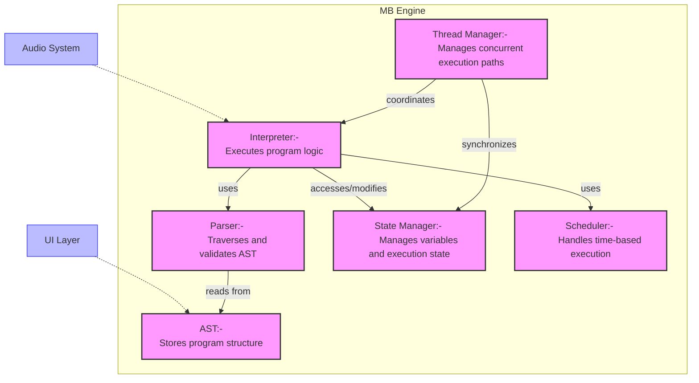
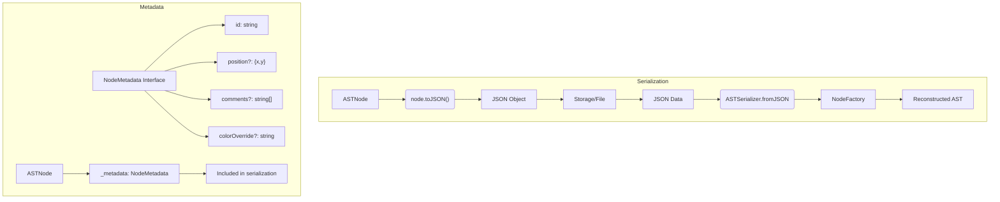
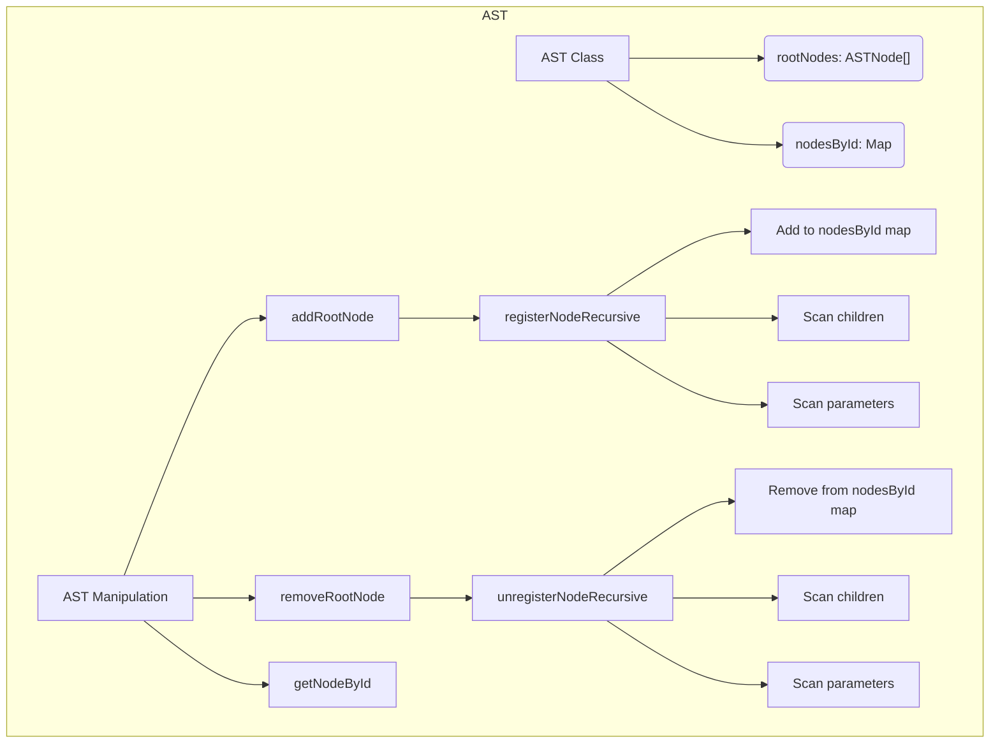
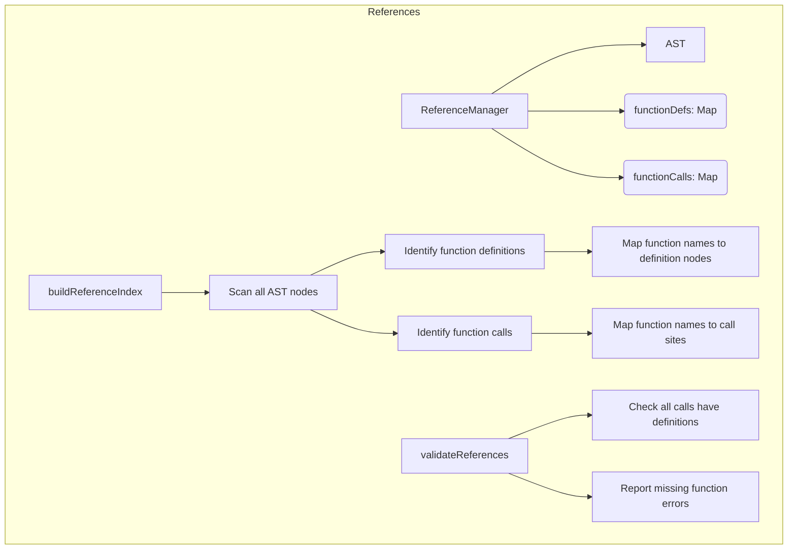
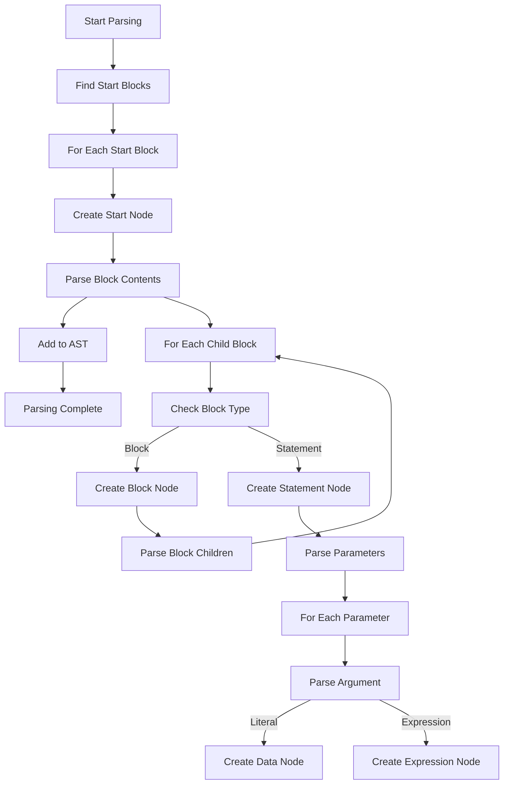
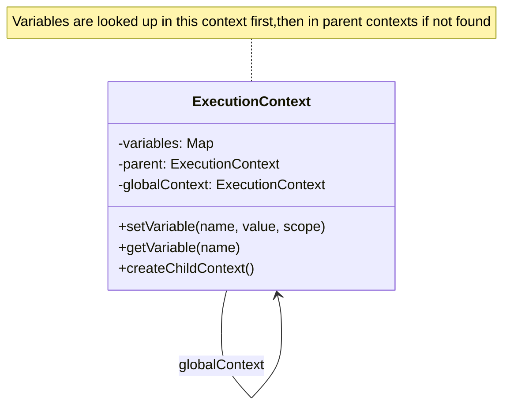
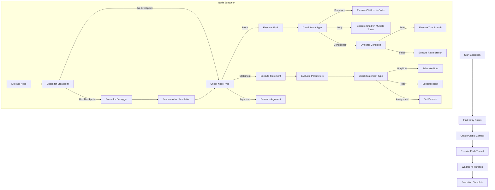
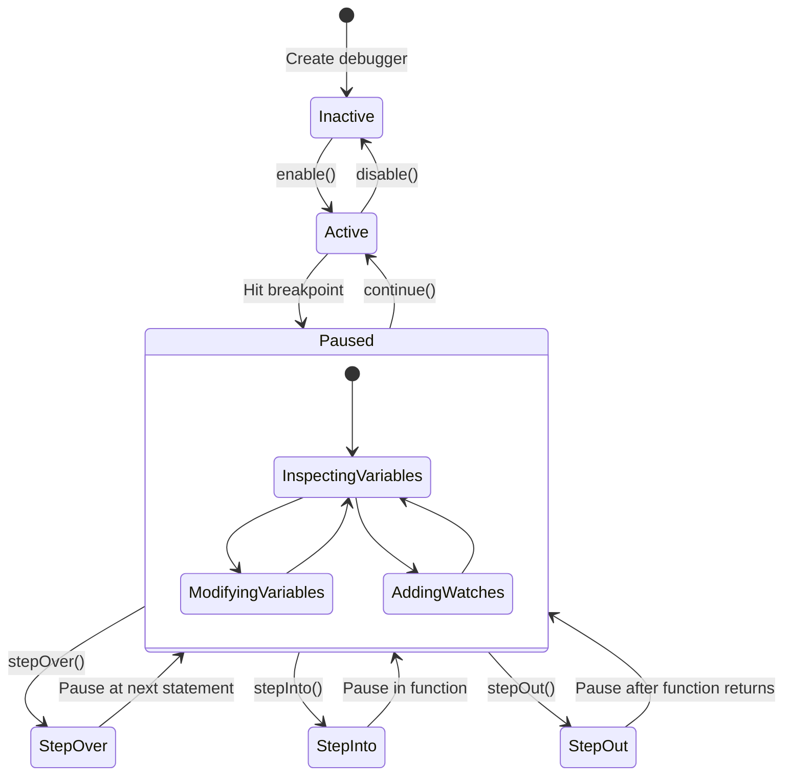
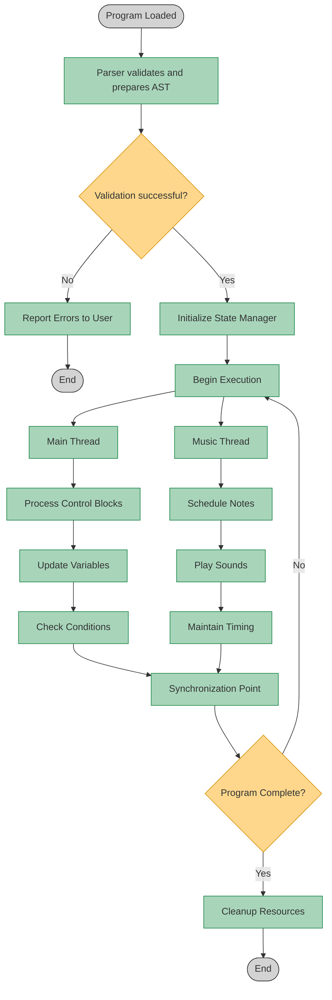

<!--markdownlint-disable-->
 ##### AST Structure Diagram

```mermaid
classDiagram
    class ASTNode {
        <<abstract>>
        +id: string
        +position: Point
        +parent: ASTNode
        +clone()
        +toString()
    }
    
    class BlockNode {
        +children: ASTNode[]
        +addChild(node: ASTNode)
        +removeChild(id: string)
    }
    
    class StatementNode {
        +execute()
    }
    
    class ArgumentNode {
        +evaluate()
    }
    
    class LoopBlockNode {
        +iterations: number
        +execute()
    }
    
    class ConditionalBlockNode {
        +condition: ArgumentNode
        +elseBlock: BlockNode
        +evaluate()
    }
    
    class NoteStatementNode {
        +pitch: string
        +duration: number
        +volume: number
        +execute()
    }
    
    class VariableStatementNode {
        +variableName: string
        +value: ArgumentNode
        +execute()
    }
    
    class MathExpressionNode {
        +operator: string
        +operands: ArgumentNode[]
        +evaluate()
    }
    
    class LiteralValueNode {
        +value: any
        +type: string
        +evaluate()
    }
    
    ASTNode <|-- BlockNode
    ASTNode <|-- StatementNode
    ASTNode <|-- ArgumentNode
    
    BlockNode <|-- LoopBlockNode
    BlockNode <|-- ConditionalBlockNode
    
    StatementNode <|-- NoteStatementNode
    StatementNode <|-- VariableStatementNode
    
    ArgumentNode <|-- MathExpressionNode
    ArgumentNode <|-- LiteralValueNode
```

##### Program Engine Architecture Diagram

```mermaid
graph TB
    subgraph "MB Engine"
        AST["AST:- 
        Stores program structure"]
        Parser["Parser:- 
        Traverses and validates AST"]
        StateManager["State Manager:- 
        Manages variables and execution state"]
        Interpreter["Interpreter:- 
        Executes program logic"]
        Scheduler["Scheduler:- 
        Handles time-based execution"]
        ThreadManager["Thread Manager:- 
        Manages concurrent execution paths"]
    end

    UILayer["UI Layer"] -.-> AST
    AudioSystem["Audio System"] -.-> Interpreter

    Parser -->|reads from| AST
    Interpreter -->|uses| Parser
    Interpreter -->|accesses/modifies| StateManager
    Interpreter -->|uses| Scheduler
    ThreadManager -->|coordinates| Interpreter
    ThreadManager -->|synchronizes| StateManager

    classDef component fill:#f9f,stroke:#333,stroke-width:2px;
    classDef external fill:#bbf,stroke:#33f,stroke-width:1px;
    
    class AST,Parser,StateManager,Interpreter,Scheduler,ThreadManager component;
    class UILayer,AudioSystem external;
```

**Node Metadata and Serialization**:

```mermaid
flowchart TD
    subgraph Serialization
        node[ASTNode] --> toJSON("node.toJSON()")
        toJSON --> jsonObj[JSON Object]
        jsonObj --> storage[Storage/File]
        
        storage --> jsonData[JSON Data]
        jsonData --> ASTSerializer("ASTSerializer.fromJSON")
        ASTSerializer --> factory[NodeFactory]
        factory --> reconstructed[Reconstructed AST]
    end
    
    subgraph Metadata
        NodeMetadata[NodeMetadata Interface] --> id[id: string]
        NodeMetadata --> position["position?: {x,y}"]
        NodeMetadata --> comments["comments?: string[]"]
        NodeMetadata --> colorOverride["colorOverride?: string"]
        
        node2[ASTNode] --> metadata["_metadata: NodeMetadata"]
        metadata --> serialization[Included in serialization]
    end
```

```mermaid
flowchart TD
    subgraph AST
        ast[AST Class] --> rootNodes("rootNodes: ASTNode[]")
        ast --> nodesById("nodesById: Map<string,ASTNode>")
        
        manipulate[AST Manipulation] --> addRoot[addRootNode]
        manipulate --> removeRoot[removeRootNode]
        manipulate --> getById[getNodeById]
        
        addRoot --> register[registerNodeRecursive]
        removeRoot --> unregister[unregisterNodeRecursive]
        
        register --> idMap[Add to nodesById map]
        register --> scanChildren[Scan children]
        register --> scanParams[Scan parameters]
        
        unregister --> idMapRemove[Remove from nodesById map]
        unregister --> scanChildrenRemove[Scan children]
        unregister --> scanParamsRemove[Scan parameters]
    end
```

```mermaid
flowchart TD
    subgraph References
        refMgr[ReferenceManager] --> ast[AST]
        refMgr --> funcDefs("functionDefs: Map<string,BlockNode>")
        refMgr --> funcCalls("functionCalls: Map<string,StatementNode[]>")
        
        build[buildReferenceIndex] --> scan[Scan all AST nodes]
        scan --> identifyDefs[Identify function definitions]
        scan --> identifyCalls[Identify function calls]
        
        identifyDefs --> mapDefs[Map function names to definition nodes]
        identifyCalls --> mapCalls[Map function names to call sites]
        
        validate[validateReferences] --> checkCalls[Check all calls have definitions]
        validate --> reportErrors[Report missing function errors]
    end
```

```mermaid
flowchart TD
    start[Start Parsing] --> findStartBlocks[Find Start Blocks]
    findStartBlocks --> loopStartBlocks[For Each Start Block]
    loopStartBlocks --> createStartNode[Create Start Node]
    createStartNode --> parseContents[Parse Block Contents]
    parseContents --> addToAST[Add to AST]
    
    parseContents --> loopChildren[For Each Child Block]
    loopChildren --> checkType[Check Block Type]
    checkType -- Block --> createBlockNode[Create Block Node]
    createBlockNode --> parseBlockChildren[Parse Block Children]
    checkType -- Statement --> createStatementNode[Create Statement Node]
    createStatementNode --> parseParameters[Parse Parameters]
    
    parseParameters --> loopParams[For Each Parameter]
    loopParams --> parseArgument[Parse Argument]
    parseArgument -- Literal --> createDataNode[Create Data Node]
    parseArgument -- Expression --> createExpressionNode[Create Expression Node]
    
    parseBlockChildren --> loopChildren
    addToAST --> done[Parsing Complete]
```

```mermaid
classDiagram
    class ExecutionContext {
        -variables: Map<string, any>
        -parent: ExecutionContext
        -globalContext: ExecutionContext
        +setVariable(name, value, scope)
        +getVariable(name)
        +createChildContext()
    }
    
    ExecutionContext --> ExecutionContext : parent
    ExecutionContext --> ExecutionContext : globalContext
    
    note for ExecutionContext "Variables are looked up in this context first,then in parent contexts if not found"
```

```mermaid
flowchart TD
    start[Start Execution] --> findEntryPoints[Find Entry Points]
    findEntryPoints --> createContext[Create Global Context]
    createContext --> executeThreads[Execute Each Thread]
    
    subgraph "Node Execution"
        executeNode[Execute Node] --> checkBreakpoint[Check for Breakpoint]
        checkBreakpoint -- Has Breakpoint --> pauseDebugger[Pause for Debugger]
        pauseDebugger --> resumeExecution[Resume After User Action]
        checkBreakpoint -- No Breakpoint --> nodeTypeCheck[Check Node Type]
        resumeExecution --> nodeTypeCheck
        
        nodeTypeCheck -- Block --> executeBlock[Execute Block]
        nodeTypeCheck -- Statement --> executeStatement[Execute Statement]
        nodeTypeCheck -- Argument --> evaluateArgument[Evaluate Argument]
        
        executeBlock --> blockTypeCheck[Check Block Type]
        blockTypeCheck -- Sequence --> executeSequence[Execute Children in Order]
        blockTypeCheck -- Loop --> executeLoop[Execute Children Multiple Times]
        blockTypeCheck -- Conditional --> evaluateCondition[Evaluate Condition]
        evaluateCondition -- True --> executeTrueBranch[Execute True Branch]
        evaluateCondition -- False --> executeFalseBranch[Execute False Branch]
        
        executeStatement --> evaluateParams[Evaluate Parameters]
        evaluateParams --> statementTypeCheck[Check Statement Type]
        statementTypeCheck -- PlayNote --> scheduleNote[Schedule Note]
        statementTypeCheck -- Rest --> scheduleRest[Schedule Rest]
        statementTypeCheck -- Assignment --> assignVariable[Set Variable]
    end
    
    executeThreads --> waitForCompletion[Wait for All Threads]
    waitForCompletion --> done[Execution Complete]
```

```mermaid
flowchart TD
    subgraph "Thread Management"
        spawnThread[Spawn Thread] --> createThread[Create Thread Entry]
        createThread --> executeFunction[Execute Thread Function]
        executeFunction -- Success --> markComplete[Mark Thread Complete]
        executeFunction -- Error --> markError[Mark Thread Error]
        
        waitForAll[Wait for All Threads] --> checkStatus[Check Thread Status]
        checkStatus -- All Complete --> collectResults[Collect Results]
        checkStatus -- Some Running --> waitMore[Wait More]
        waitMore --> checkStatus
    end
    
    subgraph "Time Scheduling"
        scheduleNote[Schedule Note] --> calculateTiming[Calculate Note Timing]
        calculateTiming --> createOscillator[Create Audio Oscillator]
        createOscillator --> createGain[Create Gain Node]
        createGain --> connectNodes[Connect Audio Nodes]
        connectNodes --> scheduleStart[Schedule Start Time]
        scheduleStart --> scheduleStop[Schedule Stop Time]
        scheduleStop --> addToEvents[Add to Scheduled Events]
        addToEvents --> advanceTime[Advance Time Offset]
    end
    
    subgraph "Synchronization"
        thread1[Thread 1] --> access[Access Shared Resource]
        thread2[Thread 2] --> access
        access --> checkLock[Check Resource Lock]
        checkLock -- Locked --> waitUnlock[Wait for Unlock]
        waitUnlock --> checkLock
        checkLock -- Unlocked --> acquireLock[Acquire Lock]
        acquireLock --> useResource[Use Resource]
        useResource --> releaseLock[Release Lock]
    end
```

```mermaid
stateDiagram-v2
    [*] --> Inactive: Create debugger
    
    Inactive --> Active: enable()
    Active --> Inactive: disable()
    
    Active --> Paused: Hit breakpoint
    Paused --> Active: continue()
    
    Paused --> StepOver: stepOver()
    StepOver --> Paused: Pause at next statement
    
    Paused --> StepInto: stepInto()
    StepInto --> Paused: Pause in function
    
    Paused --> StepOut: stepOut()
    StepOut --> Paused: Pause after function returns
    
    state Paused {
        [*] --> InspectingVariables
        InspectingVariables --> ModifyingVariables
        ModifyingVariables --> InspectingVariables
        InspectingVariables --> AddingWatches
        AddingWatches --> InspectingVariables
    }
```

### Execution Flow Diagram

```mermaid
flowchart TD
    A([Program Loaded]) --> B[Parser validates and prepares AST]
    B --> C{Validation successful?}
    C -->|No| D[Report Errors to User]
    D --> E([End])
    
    C -->|Yes| F[Initialize State Manager]
    F --> G[Begin Execution]
    
    %% Parallel execution paths
    G --> H1[Main Thread]
    G --> H2[Music Thread]
    
    %% Main Thread path
    H1 --> I1[Process Control Blocks]
    I1 --> J1[Update Variables]
    J1 --> K1[Check Conditions]
    
    %% Music Thread path
    H2 --> I2[Schedule Notes]
    I2 --> J2[Play Sounds]
    J2 --> K2[Maintain Timing]
    
    %% Synchronization point
    K1 --> L[Synchronization Point]
    K2 --> L
    
    %% Decision for loop or exit
    L --> M{Program Complete?}
    M -->|No| G
    M -->|Yes| N[Cleanup Resources]
    N --> O([End])
    
    %% Styling
    classDef process fill:#a8d5ba,stroke:#178344,stroke-width:1px;
    classDef decision fill:#ffd78c,stroke:#d68f00,stroke-width:1px;
    classDef terminal fill:#d3d3d3,stroke:#333,stroke-width:1px,border-radius:10px;
    
    class A,E,O terminal;
    class B,D,F,G,H1,H2,I1,I2,J1,J2,K1,K2,L,N process;
    class C,M decision;
```