<!--markdownlint-disable-->
# Music Blocks 4 Program Engine - GSoC 2025 Proposal

## Table of Contents

1. [Introduction](#1-introduction)
2. [Terms and Concepts](#2-terms-and-concepts)
3. [Project Details](#3-project-details)
   3.1. [Project Overview](#31-project-overview)
   3.2. [Project Objectives](#32-project-objectives)
   3.3. [Project Priorities](#33-project-priorities)
      3.3.1. [Fundamental Priorities (Must Have)](#331-fundamental-priorities-must-have)
      3.3.2. [Secondary Priorities (Should Have)](#332-secondary-priorities-should-have)
      3.3.3. [Tertiary Priorities (Nice to Have)](#333-tertiary-priorities-nice-to-have)
   3.4. [Alignment with Music Blocks Architecture](#34-alignment-with-music-blocks-architecture)
   3.5. [Critical Success Factors](#35-critical-success-factors)
4. [Functional Specifications](#4-functional-specifications)
   4.1. [Core Programming Capabilities](#41-core-programming-capabilities)
   4.2. [Non-Functional Requirements](#42-non-functional-requirements)
5. [Technical Specifications](#5-technical-specifications)
   5.1. [Program Representation Architecture](#51-program-representation-architecture)
   5.2. [Execution Engine Architecture](#52-execution-engine-architecture)
   5.3. [Technical Interfaces](#53-technical-interfaces)
   5.4. [Error Handling Architecture](#54-error-handling-architecture)
6. [Implementation Plan](#6-implementation-plan)
   6.1. [Phase 1: Program Representation (Fundamental)](#61-phase-1-program-representation-fundamental)
   6.2. [Phase 2: Basic Execution Framework (Fundamental)](#62-phase-2-basic-execution-framework-fundamental)
   6.3. [Phase 3: Time and Concurrency Framework (Secondary)](#63-phase-3-time-and-concurrency-framework-secondary)
   6.4. [Phase 4: Extension and Integration (Secondary)](#64-phase-4-extension-and-integration-secondary)
   6.5. [Static Components: Program Representation](#65-static-components-program-representation)
      6.5.1. [AST Structure Design](#651-ast-structure-design)
      6.5.2. [Program Building Utilities](#652-program-building-utilities)
   6.6. [Dynamic Components: Program Execution](#66-dynamic-components-program-execution)
      6.6.1. [Parser Implementation](#661-parser-implementation)
      6.6.2. [State Manager](#662-state-manager)
      6.6.3. [Interpreter](#663-interpreter)
      6.6.4. [Concurrency and Time Management](#664-concurrency-and-time-management)
      6.6.5. [Debugging Framework](#665-debugging-framework)
      6.6.6. [Debugging Support](#666-debugging-support)
   6.7. [Key Implementation Challenges and Approaches](#67-key-implementation-challenges-and-approaches)
7. [Implementation Milestones](#7-implementation-milestones)
8. [Evaluation and Testing Strategy](#8-evaluation-and-testing-strategy)
9. [Deliverables](#9-deliverables)
10. [Implementation Methodology](#10-implementation-methodology)
    10.1. [Iterative Development](#101-iterative-development)
    10.2. [Test-Driven Development](#102-test-driven-development)
    10.3. [Performance-First Design](#103-performance-first-design)
    10.4. [Collaborative Approach](#104-collaborative-approach)
    10.5. [Implementation Phases](#105-implementation-phases)
11. [Post-GSoC Plans](#11-post-gsoc-plans)
    11.1. [Immediate Post-GSoC Work (3-6 months)](#111-immediate-post-gsoc-work-3-6-months)
    11.2. [Medium-Term Contributions (6-12 months)](#112-medium-term-contributions-6-12-months)
12. [Conclusion](#12-conclusion)

## 1. Introduction

Music Blocks is an innovative visual programming environment designed to help students explore and learn about music, mathematics, and programming concepts through interactive experiences. Originally developed by Sugar Labs, Music Blocks empowers learners to create music through a block-based programming interface, similar to Scratch but with a focus on music creation and exploration.

The current initiative, Music Blocks v4, represents a significant leap forward in the platform's architecture. This new version aims to build upon the success of previous iterations while introducing a more modular, maintainable, and extensible design. At the heart of this redesign is the Program Engine—the core system responsible for transforming visual block arrangements into executable programs that generate music and interactive experiences.

My passion for both music and programming makes this project especially appealing. As someone who has explored music production and programming language design, I see Music Blocks as a perfect intersection of these domains. The challenge of creating an execution engine that can handle the unique requirements of musical programming—especially aspects like timing, concurrency, and real-time feedback—presents an exciting technical challenge that aligns with my skills and interests.

## 2. Terms and Concepts

Before diving into the project details, it's important to understand the key terminology and concepts that will be referenced throughout this proposal:

- **Abstract Syntax Tree (AST)**: A hierarchical tree representation of code that captures its syntactic structure. In Music Blocks, the AST represents the logical structure of a program created with visual blocks.

- **Bricks**: The visual programming elements that users interact with in the Music Blocks interface. Bricks are the visual representations of program constructs that are arranged in the UI.

- **Blocks**: Programming constructs that represent control flow structures and executable units in the program. These are the logical components represented by bricks in the UI.

- **BlockNode**: A node in the AST that represents control flow structures like loops or conditionals.

- **StatementNode**: A node in the AST that represents a single operation or instruction.

- **ArgumentNode**: A node that provides data or expressions as input to statements or blocks. These come in two types: literal values and expressions that require evaluation.

- **Parser**: The component responsible for parsing the AST according to defined grammar rules.

- **Interpreter**: The component that executes individual nodes of the AST according to operation rules.

- **State Manager**: Keeps track of program variables, execution state, and context during runtime.

- **Concurrency**: The ability to execute multiple program constructs simultaneously, including handling nested procedure calls and managing code blocks that need to run in parallel while maintaining synchronization of shared resources.

- **Time-based Instructions**: Commands that execute over a duration rather than instantaneously, aligned on a timeline across the program regardless of their specific functionality.

## 3. Project Details

### 3.1. Project Overview

The Music Blocks v4 Program Engine project focuses on developing the execution core that powers the Music Blocks platform. This involves creating a robust system for representing Music Blocks programs as Abstract Syntax Trees and implementing the components needed to execute these programs efficiently.

The current implementation in the [musicblocks-v4-lib](https://github.com/sugarlabs/musicblocks-v4-lib) repository has laid some groundwork, but significant work is needed to create a complete, performant execution engine that can handle the unique requirements of Music Blocks programming.

It's important to note that the Program Engine and Masonry (the block programming interface) are designed as independent modules with clear separation of concerns. While they interact through a shared program tree representation, they don't dictate each other's implementation details. This architectural decision ensures flexibility and maintainability by allowing each module to evolve independently.

### 3.2. Project Objectives

Based on the project description and existing PRDs, the key objectives for this GSoC project are:

1. **Refine Object-Oriented Program Syntax Constructs**:
   - Develop a comprehensive class hierarchy representing Music Blocks program elements
   - Ensure these constructs can express all required programming patterns
   - Create a flexible foundation that supports future extensions

2. **Build Abstract Syntax Tree Framework**:
   - Design and implement a robust AST representation
   - Provide utilities for manipulating and traversing the AST
   - Ensure the AST structure supports serialization/deserialization

3. **Develop Dynamic Execution Components**:
   - Create a parser to traverse AST nodes
   - Implement a state manager to track program state
   - Build an interpreter to execute expressions and instructions

4. **Address Time-based and Concurrent Execution**:
   - Design mechanisms for handling instructions that execute over time
   - Implement multi-threading capabilities for concurrent program execution
   - Ensure proper synchronization between parallel execution threads

5. **Create Comprehensive Testing Suite**:
   - Develop unit tests for all components
   - Create integration tests for the execution engine as a whole
   - Implement performance benchmarks

6. **Optimize Runtime Performance**:
   - Identify and address performance bottlenecks
   - Optimize memory usage and execution speed

### 3.3. Project Priorities

To ensure successful completion of this GSoC project, I've analyzed the project objectives and categorized implementation priorities based on their importance to Music Blocks users:

#### 3.3.1. Fundamental Priorities (Must Have)
1. **Create a usable program execution framework** - Developers must be able to encapsulate functionality of each program building construct (paralleling bricks in masonry), and structure them according to grammar rules to build a program
2. **Support basic programming constructs** - Variables, loops, conditionals that work reliably
3. **Enable timeline-aligned block execution** - Support code blocks that execute with accurate timing along a timeline, regardless of whether they produce music or other outputs
4. **Implement error reporting** - Provide clear feedback when programs have issues

These core capabilities form the essential foundation of Music Blocks and will be my primary focus to ensure a successful project outcome.

#### 3.3.2. Secondary Priorities (Should Have)
1. **Support concurrent execution** - Allow multiple code blocks to run simultaneously and handle complex procedure call chains where a block executes a procedure that executes further procedures
2. **Enable function/procedure blocks** - Support reusable code with parameters
3. **Implement debugging capabilities** - Stepping, breakpoints, and state inspection
4. **Optimize performance** - Ensure smooth execution on typical hardware

These capabilities significantly enhance the user experience and I'm committed to implementing them after the fundamentals are solid.

#### 3.3.3. Tertiary Priorities (Nice to Have)
1. **Advanced timeline features** - Support for aligning concurrent blocks of code on a timeline across the program, ensuring synchronization regardless of specific functionality
2. **Object-oriented capabilities** - Object creation and method invocation
3. **Event system** - Sophisticated event triggering and handling
4. **Performance analysis tools** - Runtime statistics and bottleneck identification

While valuable additions, these will be pursued only after higher-priority items are complete and functioning well.

### 3.4. Alignment with Music Blocks Architecture

This project builds upon the current Music Blocks v4 architecture, which separates concerns into distinct modules:

1. **User Interface Layer**: The visual block programming environment
2. **Program Representation Layer**: The AST and related structures
3. **Execution Layer**: The engine that runs the program

My focus will be primarily on layers 2 and 3, ensuring they integrate smoothly with the UI layer developed by other contributors.

It's important to emphasize that the engine and masonry components are independent modules with well-defined boundaries. While they share the program tree (either directly or through a proxy interface), neither dictates the other's implementation. My focus will be on creating an engine that operates solely on the program tree it receives, maintaining a clean separation of concerns that allows both components to evolve independently while preserving their integration points.

### 3.5. Critical Success Factors

For this project to be considered successful, several key factors must be addressed:

1. **Performance Optimization for Educational Settings**
   
   Music Blocks is often used in educational environments with varying hardware capabilities. The Program Engine must perform well not only on modern hardware but also on older devices commonly found in schools. This requires careful optimization and testing on lower-end devices.

   I'll establish performance benchmarks on representative hardware configurations and optimize critical paths to ensure acceptable performance across the spectrum of target devices.

2. **Cross-Browser Compatibility**
   
   As a web-based application, Music Blocks must function consistently across different browsers. The Program Engine needs to account for browser-specific differences in JavaScript execution, timing precision, and audio handling.
   
   I'll implement feature detection and fallback mechanisms for browser-specific APIs, and establish a testing matrix that includes all major browsers (Chrome, Firefox, Safari, Edge) across different operating systems.

3. **Scalability for Complex Musical Programs**
   
   While beginning users might create simple programs, advanced users could create complex compositions with thousands of blocks. The engine architecture must scale gracefully with program complexity.
   
   I'll design the system with scalability in mind, implementing techniques like lazy evaluation, code chunking, and strategic caching to maintain performance even with very large programs.

4. **Extensibility for Future Block Types**
   
   Music Blocks continues to evolve with new block types and capabilities. The Program Engine must be designed to accommodate future extensions without requiring significant rearchitecting.
   
   I'll create an extensible plugin system for registering new block types, operations, and capabilities, ensuring that the core engine can be enhanced without modification.

## 4. Functional Specifications

The Program Engine needs to fulfill several key functional requirements to support the Music Blocks v4 platform effectively:

### 4.1. Core Programming Capabilities

1. **Program Construct Representation**
   - Provide a framework for representing program constructs (not visual bricks)
   - Define a grammar system that specifies how constructs can be connected
   - Support structural validation of program construction
   - Enable connection validation between program elements based on type compatibility

2. **Block Execution Framework**
   - Enable execution of code blocks that operate on a timeline
   - Support blocking operations that span specific durations
   - Provide mechanisms for code blocks to produce various outputs (musical, visual, etc.)
   - Allow program execution according to specified execution rules

3. **Mathematical & Logical Operations**
   - Create a framework that enables arithmetic operations and expressions
   - Support logical operations and conditional evaluation
   - Provide variable scoping and state management
   - Enable customizable evaluation rules for expressions

4. **Control Flow Framework**
   - Enable conditional branching through structured grammar
   - Support iterative execution through various loop constructs
   - Provide function/procedure definition and invocation mechanisms
   - Allow event-based execution through structured triggers

5. **Concurrent Execution Framework**
   - Support simultaneous execution of multiple code blocks
   - Enable synchronization between concurrent execution paths
   - Handle complex procedure call chains where blocks can trigger multiple nested procedures
   - Manage resource access and prevent conflicts in concurrent execution

6. **Time-Based Operations**
   - Provide time primitive constructs for controlling execution timing
   - Enable alignment of code blocks along a timeline
   - Support synchronization points between timeline-based code segments
   - Manage time-dependent instructions with precise timing control

7. **AST Construction & Validation**
   - Provide validation mechanisms to verify whether program constructs can connect
   - Support construction-time type checking of connections
   - Enable semantic validation during program construction
   - Report detailed validation errors to guide correction

### 4.2. Non-Functional Requirements

The Program Engine must operate within certain technical constraints:

1. **Performance Requirements**
   - Execute programs with millisecond-level timing precision for time-sensitive applications
   - Support programs with at least 1000 blocks without noticeable lag
   - Maintain 60 fps when running with visual feedback enabled

2. **Platform Compatibility**
   - Function in modern web browsers without plugins
   - Support both desktop and mobile execution environments
   - Operate offline once loaded

3. **Integration Requirements**
   - Expose clean APIs for the UI layer to interact with
   - Provide observable program state for visualization
   - Support serialization for saving/loading programs

## 5. Technical Specifications

Based on the functional requirements, I propose the following technical specifications for the Program Engine implementation:

### 5.1. Program Representation Architecture

1. **AST Design**
   - Implement a class-based inheritance hierarchy with `ASTNode` as the base class
   - Use TypeScript interfaces to define contracts between node types
   - Create specialized node types that include:
     - `BlockNode`: Represents control structures and code blocks
     - `StatementNode`: Represents individual executable statements
     - `ArgumentNode`: Represents expressions and values used as inputs, with two distinct types:
       - `LiteralArgumentNode`: For direct value inputs (numbers, strings, etc.)
       - `ExpressionArgumentNode`: For computed values requiring evaluation
     - `EventNode`: Represents event triggers and handlers

   ##### AST vs Program Tree Separation

      The AST will be explicitly separated from the UI program tree:
         
      - AST contains only execution-relevant information
      - The engine will be implementation-agnostic, operating on a generic programming framework model
      - The engine will receive program representations without making assumptions about their visual/UI origins
      - Translation between the masonry (visual) layer and engine layer will occur through clearly defined interfaces

    ##### AST Structure Diagram

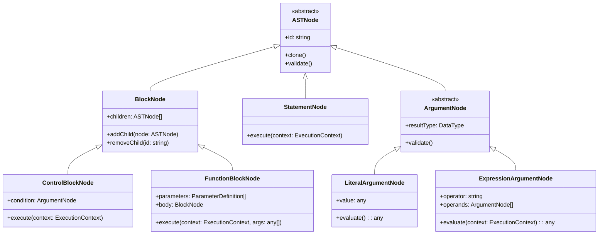

2. **Node Properties and Relationships**
   - Each node will maintain parent-child relationships via references
   - Nodes will have unique identifiers for cross-referencing
   - Type information will be embedded in nodes for runtime validation
   - Argument nodes will be strongly typed to ensure proper connections

   ##### Node Connectivity and Validation

   Connectivity between nodes will be managed through:
      
   - Type validation system that verifies compatible connections
   - Socket interface definitions specifying allowed connections
   - Pre-connection validation hooks that run before nodes are connected
   - Post-connection validation to ensure structural integrity
      
   Example validation rules:
   - Value type compatibility (number cannot connect to boolean socket)
   - Structural constraints (loop body must be a block)
   - Semantic constraints (variable must be defined before use)

##### Program Construction and Validation Process Flow
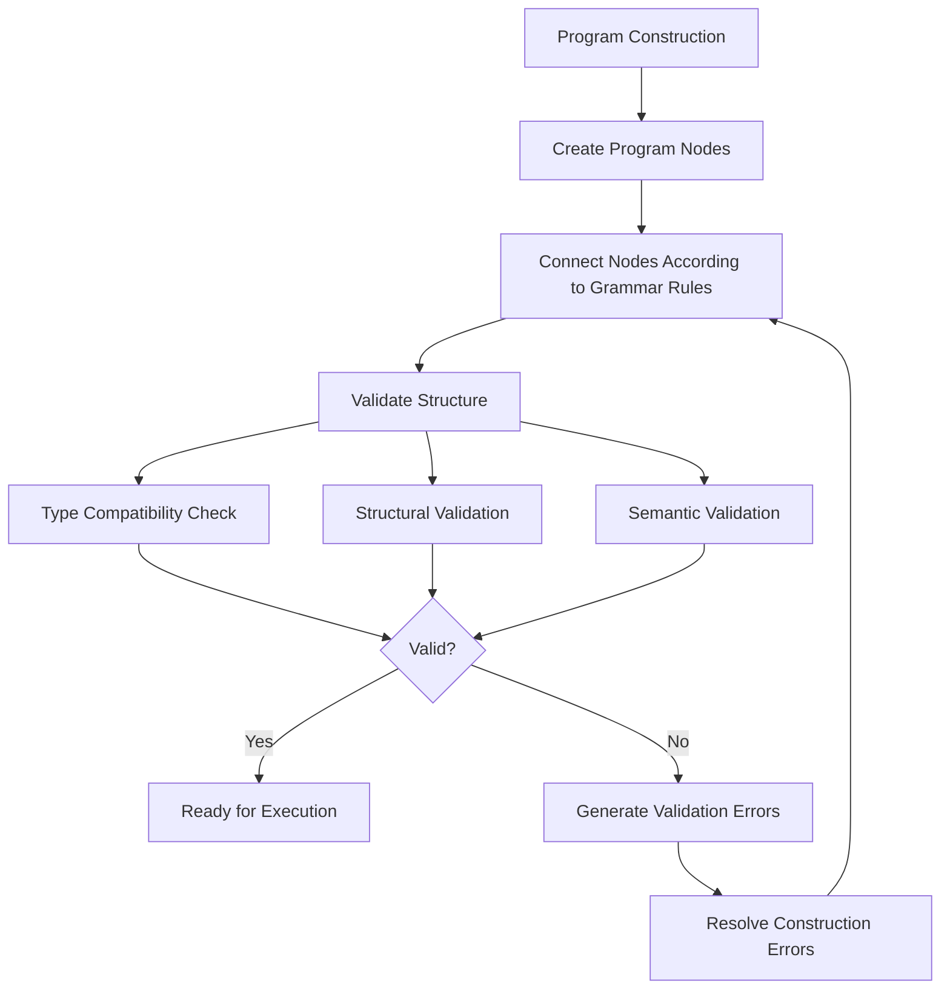

3. **State Management Model**
   - Implement a global state container with immutable update patterns
   - Use a scoping system based on execution contexts with inheritance chains
   - Support variable shadowing between different scopes
   - Provide transactional state updates to support undo/redo
   - Implement variable lifetime management that aligns with block execution lifecycle
   
   Examples of state management:
   - Local variable scope within function blocks
   - Persistence of global variables across program runs
   - Context-sensitive variables that depend on execution path
   - Transactional state updates that maintain consistency during concurrent execution

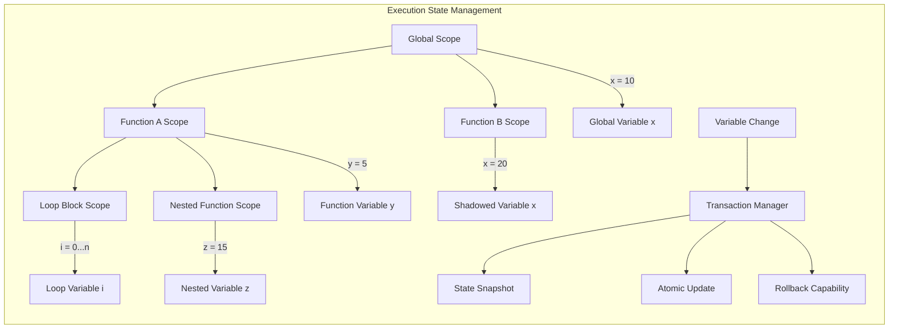

### 5.2. Execution Engine Architecture

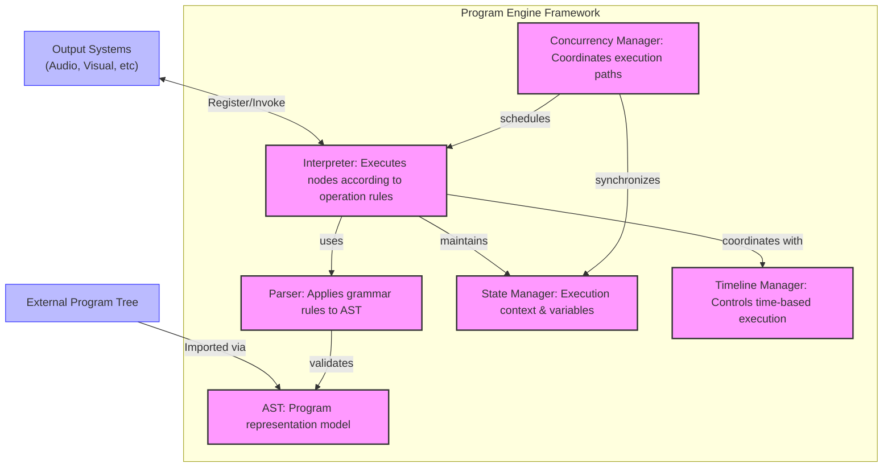

1. **Parser Design**
   - Create a recursive descent parser to traverse the AST according to grammatical rules
   - Implement visitor pattern for node type-specific processing with custom rule sets
   - Add pre-execution validation to catch type errors and structural issues before execution
   - Support customizable parsing rules to enable extension

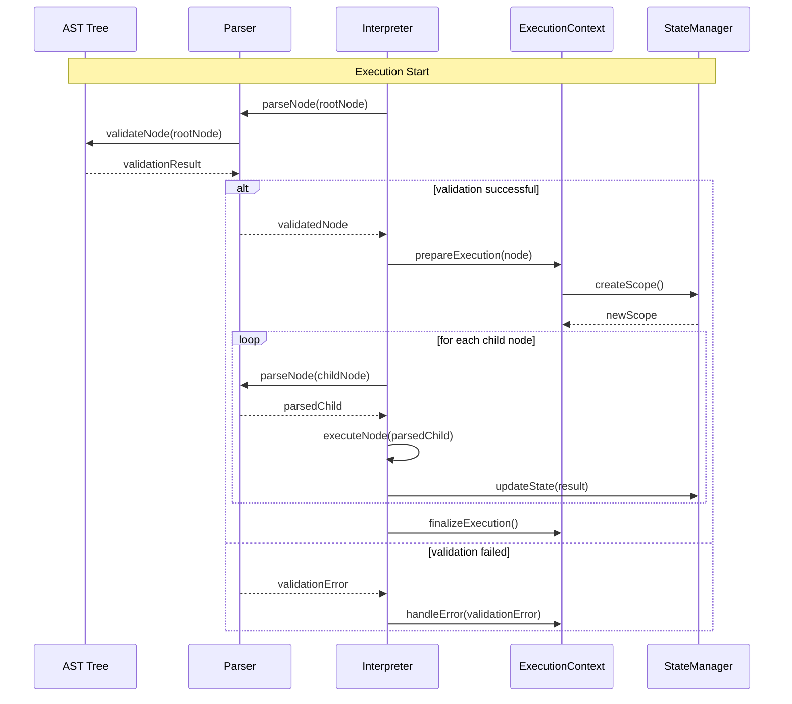

2. **Interpreter Implementation**
   - Implement a node executor system that processes nodes based on their type and operation rules
   - Create a runtime context for maintaining execution state across node boundaries
   - Provide a call stack implementation for tracking execution flow
   - Implement an expression evaluator with customizable operation rules
   - Support both synchronous and asynchronous execution models to handle time-based operations

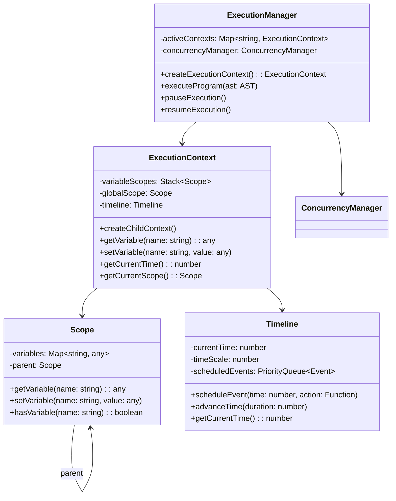

3. **Concurrency Model**
   - Implement an execution scheduler that manages multiple execution paths
   - Create synchronization primitives for coordinating concurrent execution
   - Implement resource locking mechanisms to prevent conflicts in shared state access
   - Provide messaging channels for communication between concurrent execution paths
   - Support both cooperative and preemptive multitasking patterns depending on operation needs

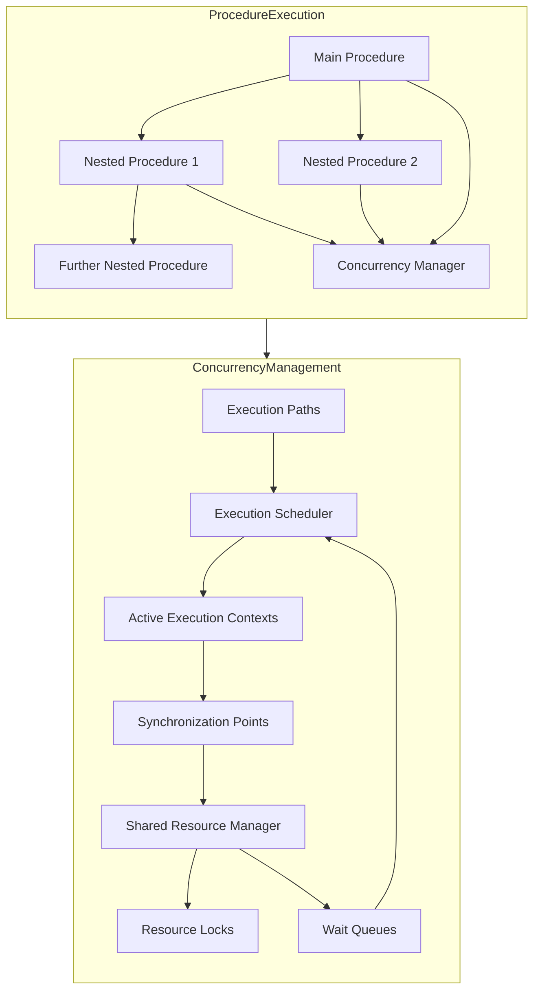

4. **Time Management System**
   - Implement timeline primitives for time-based execution control
   - Create synchronization points for aligning concurrent execution paths
   - Support variable time scaling to adjust execution speed
   - Provide precise timing controls for time-sensitive operations
   - Enable both absolute and relative timing models

```mermaid
gantt
    title Timeline-Based Execution
    dateFormat  s
    axisFormat %S
    
    section Execution Path 1
    Block 1 Execution  :a1, 0, 2s
    Block 2 Execution  :a2, after a1, 3s
    
    section Execution Path 2
    Block 3 Execution  :b1, 1, 3s
    Block 4 Execution  :b2, after b1, 2s
    
    section Synchronization
    Synchronization Point  :milestone, m1, 4, 0d
    Block 5 Execution  :c1, after m1, 2s
    
    section Timeline Controls
    Pause  :p1, 2, 1s
    Resume :after p1, 1s
```

### 5.3. Technical Interfaces

The Program Engine will expose several key interfaces to interact with other components:

1. **Program Construction Interface**
   - Node creation and connection APIs
   - Program structure validation
   - AST manipulation utilities
   - Construction error reporting and handling

2. **Program Execution Interface**
   - Execution control (start, pause, resume, stop)
   - Program state access and monitoring
   - Execution event subscriptions
   - Error handling and reporting

3. **Extension Interface**
   - Custom node type registration
   - Operation rule customization
   - Execution hook registration
   - Plugin registration and lifecycle management

4. **Integration Interfaces**
   - UI state synchronization
   - Output channel registration (audio, visual, etc.)
   - Input event handling
   - Storage integration for program persistence

5. **Debugging Interface**
   - Execution inspection and monitoring
   - Breakpoint management
   - Step execution control
   - Runtime state examination and modification

### 5.4. Error Handling Architecture

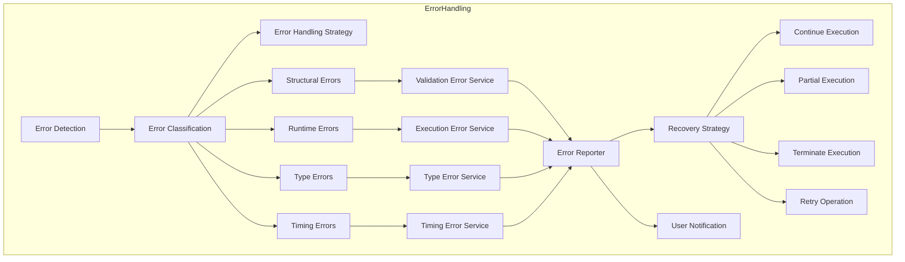

The Program Engine will implement a comprehensive error handling system:

1. **Error Classification**
   - Structural errors (invalid program construction)
   - Runtime errors (execution failures)
   - Type errors (incompatible value types)
   - Resource errors (missing or invalid resources)
   - Timing errors (time-based execution issues)

2. **Error Reporting**
   - Detailed error messages with contextual information
   - Error location tracking to identify the source node
   - Error propagation rules for nested execution contexts
   - Severity levels to distinguish critical from non-critical errors

3. **Error Recovery**
   - Safe execution modes for error-prone operations
   - Execution continuation options after non-fatal errors
   - State rollback capabilities for transactional operations
   - Graceful degradation strategies for partial execution

4. **Validation System**
   - Pre-execution program validation to catch errors early
   - Runtime type checking with clear error reporting
   - Resource availability verification before access
   - Syntax and semantic validation during program construction

## 6. Implementation Plan

My implementation approach will focus on building a robust framework for program representation and execution:

### 6.1. Phase 1: Program Representation (Fundamental)
I'll first build the program representation framework that:
- Defines a comprehensive AST structure for representing programs
- Implements node types for all required program constructs
- Creates validation rules for program construction
- Ensures serialization/deserialization capabilities
- Synchronizes with other developers working on masonry and other system components

This will provide developers with:
- A clear way to represent programmatic constructs
- Type-safe connections between program elements
- Validation during program construction
- A foundation for the execution engine

### 6.2. Phase 2: Basic Execution Framework (Fundamental)
Building on the representation layer, I'll then implement:
- Core execution environment with context management
- Simple sequential execution capabilities
- Variable management and state tracking
- Basic control structures (conditionals, loops)

This provides developers with:
- The ability to execute basic program structures
- A state management system for tracking program variables
- Control flow mechanisms for conditional and iterative execution
- Error reporting for execution issues

### 6.3. Phase 3: Time and Concurrency Framework (Secondary)
I'll then implement more advanced execution capabilities:
- Timeline-based execution control
- Concurrent execution paths with synchronization
- Function/procedure mechanisms with parameter passing
- Enhanced error handling and recovery

This enables developers to create:
- Time-aligned program elements that execute on a timeline
- Multiple execution paths that run concurrently
- Reusable procedures with parameter support
- More robust error handling and debugging

### 6.4. Phase 4: Extension and Integration (Secondary)
With the core functionality in place, I'll focus on:
- Extension points for custom node types and operations
- Integration interfaces for UI and output systems
- Performance optimizations for complex programs
- Enhanced debugging capabilities

This provides:
- A flexible framework that can be extended with new functionality
- Clean integration with other Music Blocks components
- Better performance for complex program execution
- Tools for debugging and troubleshooting

### 6.5. Static Components: Program Representation

#### 6.5.1. AST Structure Design

The foundation of the system will be a well-designed Abstract Syntax Tree (AST) structure that can represent all Music Blocks programming constructs. This includes:

1. **Base Node Types**:
   - A generic `ASTNode` base class that serves as the root for all other node types. This class will contain common properties and methods shared across different node types, ensuring a consistent and scalable structure.
   - Specialized node types for blocks, statements, and arguments. Each of these will inherit from the `ASTNode` base class and include additional properties and methods specific to their roles, providing clarity and separation of concerns.
   - Support for parent-child relationships and traversal, facilitating efficient representation of complex hierarchical structures. This includes methods for navigating to parent nodes, child nodes, and sibling nodes, making it easy to move around the AST.

2. **Node Type Hierarchy**:
   - **BlockNodes**: Represent control structures such as loops (e.g., `for`, `while`) and conditionals (e.g., `if`, `switch`). These nodes will contain other nodes as children, forming the body of the control structure and enabling nested logic.
   - **StatementNodes**: Represent single operations such as playing a note, drawing a shape, or performing a mathematical calculation. These nodes will be the leaves of the AST and will not contain other nodes, making them straightforward to evaluate.
   - **ArgumentNodes**: Represent data values or expressions that are used as inputs to statements and blocks. These nodes will include literals (e.g., numbers, strings) and more complex expressions (e.g., arithmetic operations), allowing for dynamic and flexible code.

3. **Node Metadata and Serialization**:
   - Support for storing metadata such as position (for graphical representation), color (for UI rendering), and other attributes relevant to the Music Blocks environment. This ensures that the AST can be used both for execution and visualization.
   - Serialization to/from JSON to enable saving the AST to a file and loading it back. This is crucial for persisting user projects and sharing them between different instances of the application, providing a seamless user experience.

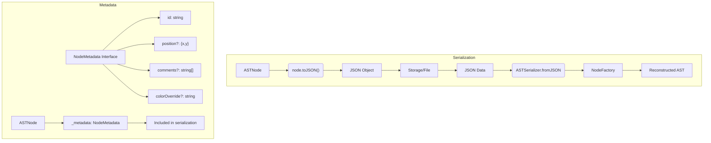

#### 6.5.2. Program Building Utilities

To support the creation and manipulation of AST structures, we will develop a set of utilities:

1. **Node Creation Utilities**:
   - Factory methods for creating different node types. These methods will ensure that nodes are created with all necessary properties initialized, helping maintain consistency across the AST and reducing the likelihood of errors.
   - Validation logic for ensuring that nodes meet expected constraints. This includes checking that nodes are connected correctly and that required properties are set, providing early feedback to users and developers.

2. **AST Manipulation**:
   - Methods for adding, removing, and modifying nodes within the AST. These methods will handle the intricacies of maintaining parent-child relationships and updating references as nodes are moved, making it easy to edit and refactor the AST.
   - Utilities for restructuring parts of the AST, such as moving a subtree from one location to another or merging multiple subtrees. This allows for complex transformations and optimizations, enabling more sophisticated programming constructs.

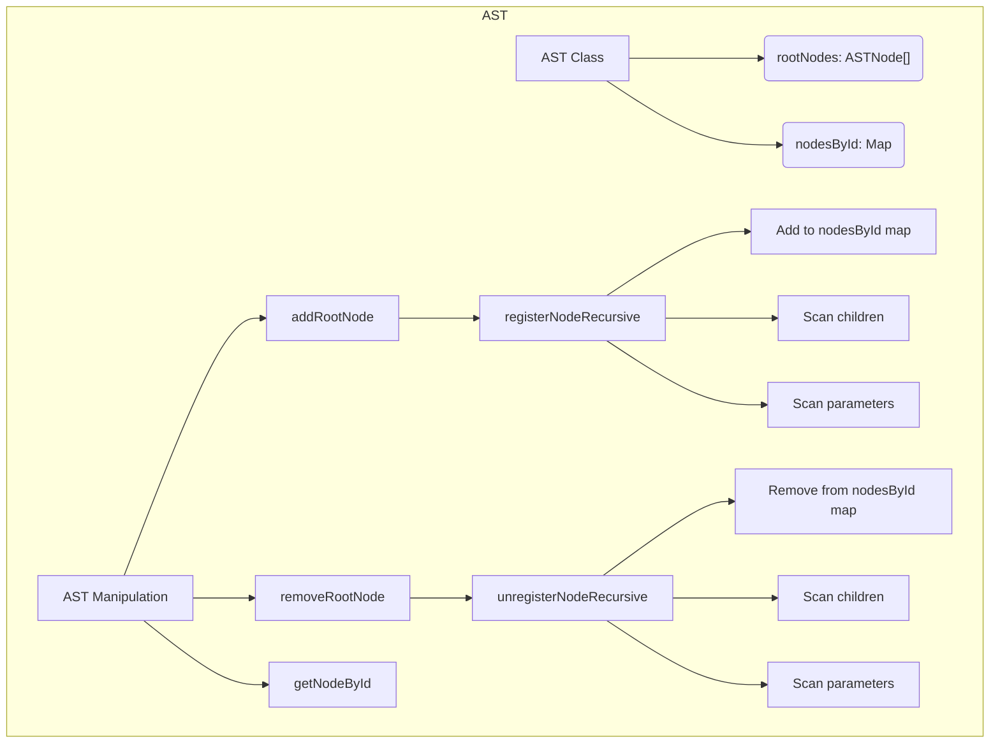

3. **Reference Management**:
   - Handling references between different parts of the AST, such as variable references, function calls, and event handlers. This ensures that the AST remains consistent and that changes to one part of the tree are reflected elsewhere.
   - Maintaining consistency when nodes are added or removed, ensuring that references are updated appropriately to prevent broken links. This is essential for preventing bugs and ensuring the reliability of the system.

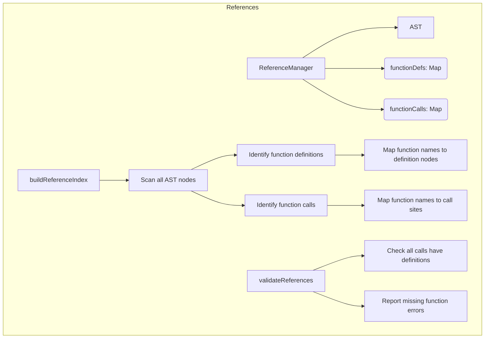

### 6.6. Dynamic Components: Program Execution

#### 6.6.1. Parser Implementation

The parser will be responsible for traversing the AST and preparing it for execution:

1. **Traversal Logic**:
   - Methods for systematically visiting nodes in the AST. This will include support for different traversal orders (e.g., pre-order, post-order) to accommodate various use cases and provide flexibility in how the AST is processed.
   - Mechanisms for invoking callbacks or executing specific logic at each node during traversal. This allows for custom processing and analysis of the AST, enabling a wide range of applications.

2. **Validation**:
   - Type checking for expressions and arguments to ensure that operations are performed on compatible types. This helps catch errors early and provides clear feedback to users.
   - Semantic validation of program structure to detect logical errors, such as using undefined variables or incorrect function signatures. This ensures that the program behaves as expected and prevents runtime errors.

3. **Optimization**:
   - Basic optimizations such as constant folding (evaluating constant expressions at compile time) to improve runtime performance. This reduces the computational load and makes the program more efficient.
   - Identification of parallelizable sections to enable concurrent execution and improve efficiency. This takes advantage of modern multi-core processors and improves overall performance.

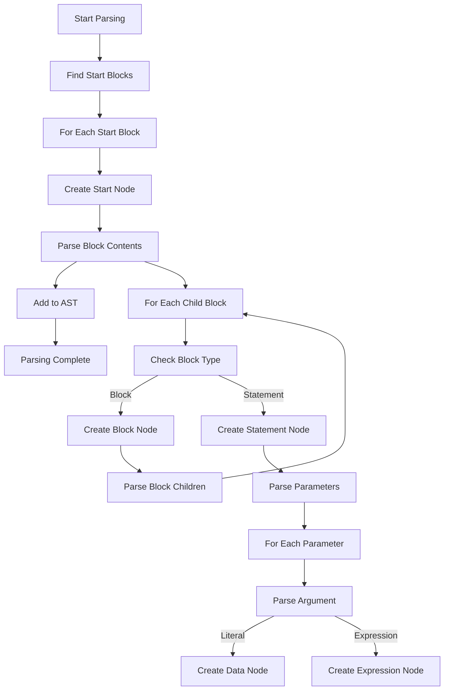

#### 6.6.2. State Manager

The state manager will track the program state during execution:

1. **Variable Management**:
   - Storage and retrieval of variables, supporting different data types and ensuring type safety. This provides a robust and flexible way to manage program state.
   - Support for different scopes (e.g., global, local, block) to manage variable lifetimes and visibility. This allows for modular and encapsulated code, improving maintainability.

2. **Execution Context**:
   - Tracking the current execution state, including the current instruction pointer, call stack, and scope stack. This provides a clear and accurate representation of the program's execution.
   - Managing stack frames for function calls, including parameter passing, local variables, and return values. This ensures that function calls are handled correctly and efficiently.

3. **Resource Management**:
   - Handling shared resources such as audio channels, graphical contexts, and external devices. This ensures that resources are used efficiently and prevents conflicts.
   - Preventing race conditions in concurrent execution by implementing synchronization mechanisms. This ensures that the program behaves correctly even in a multi-threaded environment.

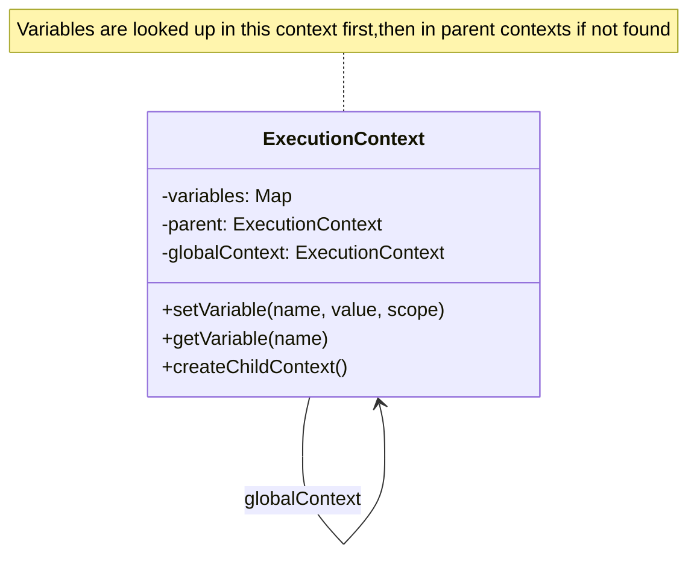

#### 6.6.3. Interpreter

The interpreter will execute the program logic:

1. **Expression Evaluation**:
   - Evaluating mathematical expressions, including arithmetic, logical, and comparison operators. This provides the core computational capabilities of the system.
   - Handling function calls, including built-in functions and user-defined functions. This enables modular and reusable code.
   - Processing logical operators and short-circuit evaluation. This ensures that logical expressions are evaluated correctly and efficiently.

2. **Statement Execution**:
   - Executing individual statements, such as playing a note, drawing a shape, or updating a variable. This provides the core functionality of the system.
   - Calling appropriate handlers for different statement types, ensuring that each statement is executed correctly. This provides a flexible and extensible execution model.

3. **Control Flow**:
   - Managing loops, conditionals, and other control structures. This includes handling loop initialization, condition checking, and iteration, providing a robust and flexible control flow mechanism.
   - Handling break, continue, and return statements to control the flow of execution. This provides powerful control flow capabilities and enables complex logic.

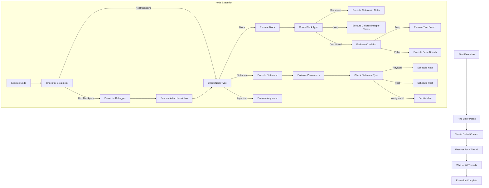

#### 6.6.4. Concurrency and Time Management

A particularly challenging aspect of the project will be handling Music Blocks' concurrency and time-based execution requirements:

1. **Concurrency Model**:
   - Implementation of parallel execution threads to allow multiple parts of the program to run simultaneously. This improves performance and responsiveness.
   - Synchronization between threads to ensure correct execution order and prevent conflicts. This ensures that the program behaves correctly even in a multi-threaded environment.
   - Handling shared resources and state, including mechanisms for locking and resource allocation. This ensures that resources are used efficiently and prevents conflicts.

2. **Time-based Execution**:
   - Scheduling notes and other time-dependent actions to ensure precise timing. This is essential for creating accurate and synchronized musical compositions.
   - Managing tempo and timing to synchronize different musical parts and maintain rhythm. This ensures that the music is played correctly and consistently.
   - Ensuring synchronization between different musical parts, such as aligning tracks and coordinating events. This ensures that the music is played correctly and consistently.

3. **Event Handling**:
   - Processing events that might influence execution, such as user input, external signals, or timed triggers. This provides a flexible and responsive execution model.
   - Supporting event-driven programming patterns, allowing the program to respond to events in a flexible and efficient manner. This enables powerful and interactive applications.

```mermaid
flowchart TD
    subgraph "Thread Management"
        spawnThread[Spawn Thread] --> createThread[Create Thread Entry]
        createThread --> executeFunction[Execute Thread Function]
        executeFunction -- Success --> markComplete[Mark Thread Complete]
        executeFunction -- Error --> markError[Mark Thread Error]
        
        waitForAll[Wait for All Threads] --> checkStatus[Check Thread Status]
        checkStatus -- All Complete --> collectResults[Collect Results]
        checkStatus -- Some Running --> waitMore[Wait More]
        waitMore --> checkStatus
    end
    
    subgraph "Time Scheduling"
        scheduleNote[Schedule Note] --> calculateTiming[Calculate Note Timing]
        calculateTiming --> createOscillator[Create Audio Oscillator]
        createOscillator --> createGain[Create Gain Node]
        createGain --> connectNodes[Connect Audio Nodes]
        connectNodes --> scheduleStart[Schedule Start Time]
        scheduleStart --> scheduleStop[Schedule Stop Time]
        scheduleStop --> addToEvents[Add to Scheduled Events]
        addToEvents --> advanceTime[Advance Time Offset]
    end
    
    subgraph "Synchronization"
        thread1[Thread 1] --> access[Access Shared Resource]
        thread2[Thread 2] --> access
        access --> checkLock[Check Resource Lock]
        checkLock -- Locked --> waitUnlock[Wait for Unlock]
        waitUnlock --> checkLock
        checkLock -- Unlocked --> acquireLock[Acquire Lock]
        acquireLock --> useResource[Use Resource]
        useResource --> releaseLock[Release Lock]
    end
```

#### 6.6.5. Debugging Framework

A key aspect of the Program Engine will be a comprehensive debugging framework that enables users to understand and troubleshoot their programs:

1. **Breakpoint Architecture**:
   - Integration of breakpoint capability directly into the execution model
   - Support for conditional breakpoints that trigger only when specific conditions are met
   - Efficient implementation that minimizes performance impact when debugging is not active

2. **Program Flow Control**:
   - Execution state snapshotting to enable pausing and resuming execution
   - Implementation of execution step granularity controls (step into, over, out)
   - Careful management of execution context during debugging to maintain program integrity

3. **State Visualization and Modification**:
   - Read and write access to program variables during debugging pauses
   - Call stack introspection to show execution path
   - Ability to modify program state during debugging pauses to test alternative scenarios

The debugging framework will be implemented as a core feature of the engine, not as an afterthought. This approach ensures that debugging capabilities are deeply integrated and provide meaningful insights into program behavior.

#### 6.6.6. Debugging Support

To aid development and user experience, the engine will include comprehensive debugging capabilities focused on helping users understand and troubleshoot their programs:

1. **Interactive Debugging Tools**:
   - **Breakpoint System**: Implementation of configurable breakpoints that can be set at any executable node in the program tree
   - **Step Execution Controls**: Ability to execute programs one instruction at a time with "step into" (descend into function calls), "step over" (execute function calls without stepping into them), and "step out" (execute until current function returns)
   - **Execution Visualization**: Real-time highlighting of currently executing blocks to help users visually track program flow

2. **Program State Inspection**:
   - **Variable Inspector**: Interactive tool for examining all variables in the current scope during execution pauses
   - **Call Stack Viewer**: Display of the current execution stack, showing nested function calls and their origins
   - **Expression Evaluation**: Ability to evaluate arbitrary expressions in the context of the current execution state
   - **Watch Expressions**: Support for persistent expressions that are evaluated automatically at each execution step

3. **Error Handling and Recovery**:
   - Detailed error reporting, including error messages, stack traces, and context information
   - Recovery mechanisms for non-fatal errors, allowing programs to continue execution where possible
   - Suggested fixes for common programming mistakes

4. **Performance Analysis**:
   - Execution time tracking for different program segments
   - Identification of potential performance bottlenecks
   - Resource utilization monitoring

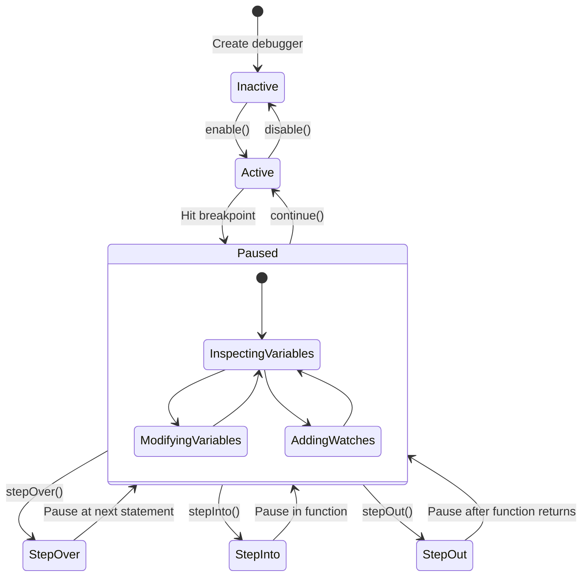

### Execution Flow Diagram
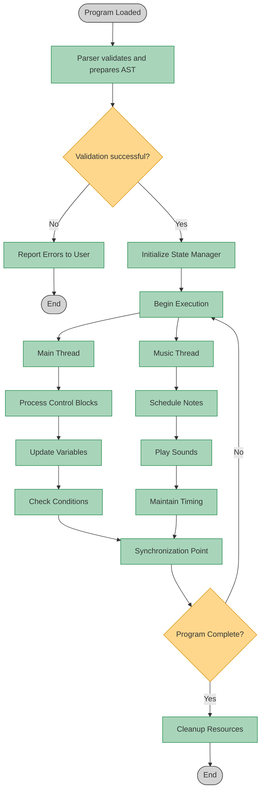

### 6.7. Key Implementation Challenges and Approaches

While developing the Program Engine, I anticipate several challenging aspects that will require careful consideration:

#### Challenge 1: Real-time Timing Precision

Timeline-aligned execution requires millisecond-level timing precision. Browser JavaScript environments aren't designed primarily for real-time applications, which creates challenges for maintaining precise timing.

**My Approach**: I'll implement a hybrid scheduling system that combines lookahead scheduling with dynamic adjustment. The system will schedule events several hundred milliseconds in advance using requestAnimationFrame and the Web Audio API's timing primitives for high-precision timing requirements. This approach will include continuous monitoring of timing drift and compensation mechanisms to maintain synchronization across execution paths.

#### Challenge 2: Memory Management for Long-Running Programs

Complex programs can run for extended periods, potentially leading to memory issues in JavaScript's garbage-collected environment.

**My Approach**: I'll implement strategic resource management focused on the JavaScript environment. This includes minimizing object creation in hot paths, using object pooling where appropriate for frequently created temporary objects, and implementing explicit cleanup for resources when they're no longer needed. I'll work within JavaScript's memory model rather than trying to implement lower-level memory management patterns that might be counterproductive in a browser environment.

#### Challenge 3: Balancing Abstraction with Performance

Creating an elegant object-oriented representation of the program constructs might introduce performance overhead through excessive indirection and object creation.

**My Approach**: I'll leverage TypeScript's type system to create clear abstractions while keeping the runtime representation efficient. This includes using interfaces for type safety during development while ensuring the compiled JavaScript remains performant. For performance-critical paths, I'll implement optimized code that maintains type safety but minimizes the abstraction overhead.

#### Challenge 4: Ensuring Deterministic Execution

For educational purposes, it's important that programs execute deterministically across different environments and runs, but concurrency introduces potential non-determinism.

**My Approach**: I'll implement a deterministic scheduling algorithm for concurrent operations based on a predictable execution model. This will involve creating a priority-based scheduler that resolves execution order conflicts consistently. For operations requiring randomness, I'll provide a configurable pseudo-random number generator with seed control, allowing reproducible results when needed for educational examples.

## 7. Implementation Milestones

I've developed these milestones to ensure I deliver the fundamental capabilities first, with clear user-focused success criteria:

### Milestone 1: Basic Block Execution (Weeks 1-3)
**User Outcome**: Ability to execute simple sequences of blocks

**Deliverables**:
- Basic block representation system
- Sequential execution of statements
- Simple variable management
- Mathematical operations

**Evaluation Criteria**:
- Can create and run a program that calculates values
- Variables can store and retrieve different data types
- Sequential blocks execute in the correct order
- Simple programs produce expected results

### Milestone 2: Control Structures & Music Basics (Weeks 4-6)
**User Outcome**: Ability to create programs with decision-making and repetition that produce musical output

**Deliverables**:
- If/else conditional execution
- Loop structures implementation
- Basic note playing capability
- Simple timing mechanisms

**Evaluation Criteria**:
- Conditional blocks correctly control program flow
- Loops repeat the specified number of times
- Note blocks produce the correct pitches
- Musical sequences play with basic timing

### Milestone 3: Functions & Enhanced Music (Weeks 7-8)
**User Outcome**: Ability to create reusable musical patterns and more complex compositions

**Deliverables**:
- Function/procedure blocks with parameters
- Return value handling
- Enhanced note properties (duration, volume)
- Improved timing accuracy

**Evaluation Criteria**:
- Custom functions can be defined and called
- Parameters correctly pass values to functions
- Musical notes play with appropriate properties
- Timing is consistent across musical sequences

### Milestone 4: Concurrency & Synchronization (Weeks 9-10)
**User Outcome**: Ability to create multi-part compositions with synchronized elements

**Deliverables**:
- Parallel execution system
- Thread synchronization mechanisms
- Resource management for shared components
- Event-based execution triggers

**Evaluation Criteria**:
- Multiple block stacks can execute simultaneously
- Parallel parts stay properly synchronized
- Musical compositions maintain timing across parts
- Events correctly trigger program execution

### Milestone 5: Error Handling & Refinement (Weeks 11-12)
**User Outcome**: Improved reliability and user feedback

**Deliverables**:
- Comprehensive error detection and reporting
- Runtime recovery mechanisms
- Performance optimizations
- Basic debugging capabilities

**Evaluation Criteria**:
- Clear error messages help users identify problems
- Programs can recover from non-fatal errors
- Complex programs run without performance issues
- Users can inspect program state during execution

## 8. Evaluation and Testing Strategy

To ensure the Program Engine meets the requirements and operates correctly, I'll implement a comprehensive testing strategy:

### Unit Testing

I'll create unit tests for each component of the system, focusing on:

- **AST Node Tests**: Verify that each node type functions correctly in isolation
- **Parser Tests**: Ensure the parser correctly traverses different AST structures
- **State Manager Tests**: Confirm that variable management works across different scopes
- **Interpreter Tests**: Validate that expressions and statements execute as expected
- **Concurrency Tests**: Verify that parallel execution works correctly

For unit testing, I'll use Jest with TypeScript support, aiming for >90% code coverage.

### Integration Testing

Integration tests will verify that the components work together correctly:

- **End-to-End Execution Tests**: Running complete programs through the engine
- **Cross-Component Tests**: Testing interactions between the parser, state manager, and interpreter
- **Edge Case Tests**: Verifying behavior with complex or unusual program structures

### Performance Testing

Given the real-time nature of music applications, performance testing is crucial:

- **Benchmarking**: Measuring execution time for common operations
- **Memory Profiling**: Analyzing memory usage during execution
- **Load Testing**: Evaluating performance with large programs

I'll establish baseline performance metrics early in development and regularly compare against them to catch regressions.

### User Acceptance Testing

Working with the broader Music Blocks community, I'll:

- Create sample programs that demonstrate typical usage patterns
- Collect feedback on the engine's behavior and performance
- Iterate based on user experience reports

This approach ensures the engine not only meets technical requirements but also serves the needs of actual users.

## 9. Deliverables

By the end of the GSoC period, I plan to deliver the following:

1. **Complete Program Engine Implementation**:
   - Full implementation of all static components (AST, Node Types, etc.)
   - Full implementation of all dynamic components (Parser, Interpreter, etc.)
   - Integration with the overall Music Blocks v4 architecture

2. **Comprehensive Test Suite**:
   - Unit tests for all components
   - Integration tests for the full execution flow
   - Performance benchmarks

3. **Documentation**:
   - Technical documentation describing the engine's architecture
   - API documentation for all public interfaces
   - Usage examples and tutorials

4. **Example Programs**:
   - A collection of sample Music Blocks programs that demonstrate the engine's capabilities
   - Programs that specifically test edge cases and performance limits

## 10. Implementation Methodology

My approach to implementing the Program Engine will follow these methodological principles:

### 10.1. Iterative Development

I'll focus on building the system incrementally, starting with the core components and gradually adding more complex features. This approach will allow for regular feedback and adjustments throughout the development process.

### 10.2. Test-Driven Development

For each component, I'll begin by writing tests that define the expected behavior. This will ensure that the implementation meets requirements and will facilitate future refactoring without introducing regressions.

### 10.3. Performance-First Design

Given the real-time nature of music applications, performance considerations will be factored into the design from the beginning, rather than treated as an afterthought.

### 10.4. Collaborative Approach

I'll work closely with the project mentors and other contributors to ensure my implementation aligns with the broader vision for Music Blocks v4.

### 10.5. Implementation Phases

Based on the prioritized needs of Music Blocks users, my implementation will proceed through these phases:

#### Phase 1: Program Representation Framework
- Implement comprehensive AST node hierarchy
- Create program construction and validation system
- Synchronize with masonry team on program representation
- Build serialization/deserialization capabilities

#### Phase 2: Core Execution Framework
- Implement state management system
- Build basic execution model for sequential operations
- Create control flow mechanisms (conditionals, loops)
- Develop error handling and reporting system

#### Phase 3: Advanced Execution Capabilities
- Implement timeline-based execution
- Create concurrent execution framework
- Build function/procedure system with parameter passing
- Develop debugging and inspection tools

#### Phase 4: Optimization and Refinement
- Implement performance optimizations
- Enhance error recovery mechanisms
- Improve debugging capabilities
- Fine-tune time-sensitive operations

#### Phase 5: Integration and Extensions
- Finalize integration with other Music Blocks components
- Implement extension mechanisms for custom functionality
- Create comprehensive documentation
- Develop example programs demonstrating capabilities

## 11. Post-GSoC Plans

My commitment to Music Blocks extends well beyond the GSoC period. I've identified specific areas where I plan to contribute after the program concludes:

### 11.1. Immediate Post-GSoC Work (3-6 months)

1. **Bug Fixes and Stability**
   - Address issues discovered during wider community testing
   - Implement additional edge case handling based on real-world usage
   - Conduct monthly performance audits to identify and resolve regressions

2. **Documentation and Knowledge Transfer**
   - Create a comprehensive technical guide to the Program Engine architecture
   - Record video walkthroughs of the codebase for future contributors
   - Develop a troubleshooting guide for common issues

3. **Education Integration Support**
   - Work with educators to create lesson plans that utilize Music Blocks v4
   - Develop a starter kit of example programs for classroom use
   - Create documentation specifically targeted at teachers with limited programming background

### 11.2. Medium-Term Contributions (6-12 months)

1. **Advanced Feature Development**
   - Implement a just-in-time compilation system for frequently executed code blocks
   - Create a visual debugging/tracing tool that shows program execution in real-time
   - Develop an optimization system that can suggest improvements to user programs

2. **Community Building Activities**
   - Organize monthly virtual contributor meetups to attract new developers
   - Create and maintain a dedicated forum for Music Blocks developers
   - Develop a mentorship program for new contributors

3. **Integration with Other Educational Tools**
   - Build connectors to allow Music Blocks to interact with other Sugar Labs projects
   - Develop export capabilities to standard music formats (MIDI, MusicXML)
   - Create integration points with common classroom management systems

This isn't just a list of good intentions—I'm making a concrete commitment to remain an active contributor to Music Blocks. My experience with both education and music technology has shown me the transformative potential of tools like Music Blocks, and I'm passionate about helping this project reach its full potential as an educational platform.

## 12. Conclusion

The Music Blocks v4 Program Engine represents a challenging and exciting opportunity to build a core system that will power creative musical exploration for students around the world. The project demands technical excellence across multiple domains—from abstract syntax trees and interpreters to concurrent programming and real-time audio scheduling.

I'm confident that my background in TypeScript, object-oriented programming, and program execution systems positions me well to tackle this challenge. More importantly, I'm deeply passionate about both the technical aspects of this project and its educational mission.

By building a robust, performant, and maintainable Program Engine, we can ensure that Music Blocks v4 provides an engaging and accessible platform for exploring the intersections of music, mathematics, and programming. I'm excited about the opportunity to contribute to this important educational tool and look forward to working with the Sugar Labs team to bring this vision to reality.

Thank you for considering my proposal. I look forward to discussing it further and addressing any questions you may have.